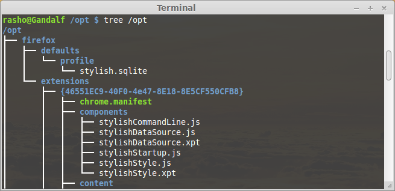
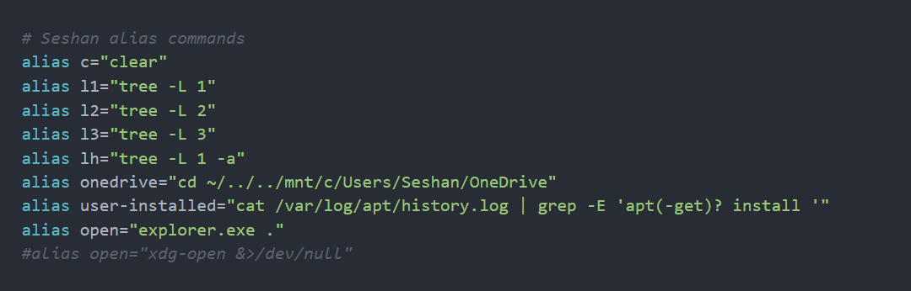
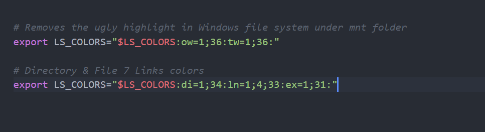

# Setup Node on Linux Subsystem

# **Windows 10 Computer Setup**

Instructions to help you set up the Linux subsystem on Windows 10

During Bootcamp we'll be doing all our work inside a Windows Subsystem for Linux (WSL) environment, whereas during Foundations you were working directly within your Windows environment. This means you'll need to work through all the setup steps below, even if you've already been using node, VS Code, etc. in your Windows environment.

1. Go to the start Menu and type `Check for updates`. Make sure that your Windows has the most recent updates (Optional as well as Recommended ones, but you don't need to upgrade to Windows 11 if you don't want to).
    - Press the Windows key and type `winver` and press Enter
    - Confirm that your Windows is version 2004 and higher (Build 19041 and higher) or any Windows 11 version
    - If your Windows version is less than Build 19041, let one of the facilitators know and upgrade to Windows 2H
2. Go into Control Panel > Program > Turn Windows features on and off
    - Check Linux Subsystem for Linux
    - Check Virtual Machine Platform
3. Go to the Start Menu and open Windows Powershell as an Administrator
    - Put this command in Powershell `wsl --install` and hit enter
    - Restart your computer
4. Download Windows Terminal and Ubuntu 20.04 from Windows Store
5. Open Ubuntu from the Start Menu and let it finish installation
    - When prompted, enter a username (e.g. your first name) and a password - this is the username that Linux will run as by default
    - IMPORTANT: When you type in your password, you will notice nothing happens, this is a feature in Linux for security purposes.
    - For Full Name etc. you can hit Enter to leave them blank
    - If it says installing for more than 5 minutes, close the Ubuntu window and re-open it
6. Configure your Windows Terminal
    - Open your Windows Terminal application (find this by typing `Windows Terminal` in the Start menu, it is NOT the same as Powershell) and select the dropdown next to the new tab button then select Settings, then "Open JSON file"
    - Scroll down until you find this section:
        
        ```json
        {
                    "guid": "{07b52e3e-de2c-5db4-bd2d-ba144ed6c273}",
                    "hidden": false,
                    "name": "Ubuntu-20.04",
                    "source": "Windows.Terminal.Wsl"
         },
        ```
        
    - Copy the value of the "guid" field, then paste it in to the `defaultProfile` property near the top of the file.
        
        ```json
        "defaultProfile": "{07b52e3e-de2c-5db4-bd2d-ba144ed6c273}",
        ```
        
    - Next, add these properties to the Ubuntu section (the same section you got the "guid" from in the previous step)
        
        ```json
        "colorScheme": "One Half Dark",
        "startingDirectory": "//wsl$/Ubuntu/home/[your_Linux_username]"
        ```
        
    - Once you have pasted it in, your Linux section should look like this (but instead of `maia`, it would say YOUR username):
        
        ```json
        {
                    "guid": "{07b52e3e-de2c-5db4-bd2d-ba144ed6c273}",
                    "hidden": false,
                    "name": "Ubuntu-20.04",
                    "source": "Windows.Terminal.Wsl",
                    "colorScheme": "One Half Dark",
                    "startingDirectory": "//wsl$/Ubuntu/home/maia"
        },
        ```
        
7. Install some required libraries including zsh
    - Put this command into your terminal: `sudo apt-get update`
    - Then this command: `sudo apt-get install build-essential python-is-python3 zsh` (this should install three things: build-essential, python and zsh)
    - If you get any errors during these installs, we recommend you resolve them before proceeding. Try running `sudo apt-get update --fix-missing` and then running each of the
    - three installs individually:
        - `sudo apt-get install build-essential`
        - `sudo apt-get install python-is-python3`
        - `sudo apt-get install zsh`.
8. Make zsh the default shell, and restart your Windows Terminal
    - Put this command into your terminal: `chsh -s $(which zsh)`
    - Restart the Windows Terminal application
    - If you get a page full of info about "This is the Z Shell configuration for new users...", press q (Quit and do nothing)
9. Install oh-my-zsh from inside the Windows Terminal
    - Enter this command into your terminal (note that it's one long line, even if it displays as two lines on the page where you're reading this): `sh -c "$(curl -fsSL https://raw.githubusercontent.com/ohmyzsh/ohmyzsh/master/tools/install.sh)"`
    - Restart the Windows Terminal application and open an Ubuntu tab using the little `+` button in the top left corner
        - For the remainder of these setup instructions, and at the start of Bootcamp, when we say "terminal" we mean this Ubuntu terminal, i.e. an Ubuntu tab within the Windows Terminal application -- you'll know it's right if you can see the penguin!
        - At the bottom of this file we'll tell you how to run a terminal within VS Code but please use the Ubuntu terminal for these setup instructions and for any `npm install` actions throughout Bootcamp, and please don't use Git Bash for any Bootcamp work
    - If the prompt in your terminal is now a little arrow and a tilde (~), instead of "yourname@...", that's OK (you'll change it again in a later step)
10. Install VS Code if it isn't already installed
    - [https://code.visualstudio.com/download](https://code.visualstudio.com/download) Make sure you download he 64bit version and for all users because if you download the current user version. It will not save it into your Program Files
11. In your terminal, open VS Code with `code .` (*don't* open VS Code from the Start Menu, desktop link or any other way)
12. Install the following VS Code extensions
    - ESLint
    - Remote - WSL
    - Live Share (online students only)
    - vscode-icons (optional, but pretty 😉)
    - GitLens (optional)
13. Restart your terminal
14. If your terminal is opening at `[user]@machineId /` (slash ending) instead of `[user]@machineId ~` (tilde ending), this means the terminal is opening at root. To make it open at home (~) instead (recommended!), add the following lines to the bottom of your .zshrc file as well:
    
    ```bash
    if [[ $(pwd) == / ]]
    then
        cd ~
    fi
    ```
    
15. Open VS Code again with `code .`
    - This should begin downloading the VS Code Server
    - When prompted for access (by Windows Defender Firewall), click "Allow access"
16. Install nvm
    - Enter this command into your terminal: `curl -o- https://raw.githubusercontent.com/nvm-sh/nvm/v0.35.3/install.sh | bash`
        
        [GitHub - nvm-sh/nvm: Node Version Manager - POSIX-compliant bash script to manage multiple active node.js versions](https://github.com/nvm-sh/nvm)
        
17. Move the 3 nvm lines from the bottom of `.bashrc` to the bottom of `.zshrc`
    - This is the trickiest step!
    - Run this command to open your .bashrc config file: `code ~/.bashrc`
    - Scroll down to the bottom of the file and cut the three lines at the bottom that look like this:
        
        ```bash
        export NVM_DIR="$HOME/.nvm"
            [ -s "$NVM_DIR/nvm.sh" ] && \. "$NVM_DIR/nvm.sh"  # This loads nvm
            [ -s "$NVM_DIR/bash_completion" ] && \. "$NVM_DIR/bash_completion"  # This loads nvm bash_completion
        ```
        
    - Run this command to open your .zshrc file: `code ~/.zshrc`
    - Paste the nvm lines you cut from the .bashrc file down at the bottom of the .zshrc file
18. Get rid of the distracting green highlighting in your terminal (optional, but recommended):
    - In your .zshrc file (that you opened in the above step), find this line and uncomment it (i.e. delete the `#`):
        
        ```bash
        # DISABLE LS_COLORS="true"
        ```
        
19. Change the oh-my-zsh theme to your choice eg: “bira”
    - Scroll to the top of the *.zshrc* file and replace the `ZSH_THEME=` value with 'bira'. You can find out more about which themes you link by visiting this website to get an idea: [https://travis.media/top-12-oh-my-zsh-themes-for-productive-developers/](https://travis.media/top-12-oh-my-zsh-themes-for-productive-developers/)
20. Restart your terminal
21. Install the latest "Long Term Support" (i.e. very stable) version of node
    - Run this command in your terminal: `nvm install --lts` This will only install all the stable versions on your distro. LTS mean (Long Term Support)
22. Make VS Code your default Git editor
    - Run this command in your terminal: `git config --global core.editor "code --wait"`
23. Enable automatic colour-coding of brackets and automatic fixing of linting errors on file save
    - In VS Code, click the Settings cog button in the bottom left and open the Command Palette. Type `settings.json` into the little search box that appears at the top of your screen, and then click on the `Preferences: Open Settings (JSON)` option to open your `settings.json` config file. Paste in these contents:
        
        ```json
        "editor.bracketPairColorization.enabled": true,
        "editor.codeActionsOnSave": { "source.fixAll.eslint": true }
        ```
        
    - Note that each entry in your `settings.json` should end in a comma except for the last one, so if there are some existing entries you'll need to add a comma before pasting the above lines
24. Restart your PC

---

# **Testing your setup**

1. Test that you have Node.js installed
- Open up your Ubuntu Terminal. You will see an error Error: `N/A: version "N/A -> N/A" is not yet installed` This is because not does not have a default version set up.
- View which version of node is installed. `nvm ls-remote` You can see the ones in green are the sable ones. The ones that you installed on your distro
- Set your default node version. Eg: `nvm alias default node v16.13.2` Make sure you pick the correct version from the list of node versions.
- Now when you `nvm ls` You should not get an error on start up.
- Open a new Ubuntu terminal and type `node`
- You should see something like this (the exact version number doesn't matter but it should start with `16`):
    
    ```bash
    $ node
    Welcome to Node.js v16.13.1.
    Type ".help" for more information.
    >
    ```
    
    - This is called the REPL ("Read Evaluate Print Loop")
    - You should be able to write simple Javascript here, e.g. try typing `2 + 2` or `Math.random()`
    - When you've finished trying it out, do `Ctrl-C` then `Ctrl-C` again, to get out of the REPL
1. Test that you can you can clone a repo
    
    From your Ubuntu terminal, clone down any Foundations repo, e.g. `git clone https://github.com/dev-academy-foundations/javascript-carnival` (you've probably already cloned this into your Windows filesystem using Git Bash, but now you're cloning it a second time, into your Linux filesystem)
    
    - If you use HTTPS when connecting to GitHub, you'll need to put in your GitHub *token* when it asks for a password, not your regular GitHub password
    - Using SSH when connecting to GitHub is also fine
    - For the repo you just cloned, cd ("change directory") into that folder, e.g. `cd javascript carnival`, then do `code .`
    - This should open VS Code and you should be able to see the code from that repo

---

# **Where to save your files**

We recommend that you store all your Bootcamp files, folders and repos within your WSL (Linux) filesystem. This should happen automatically when you create directories, clone repos, etc. from the Linux command prompt. We recommend you DON'T store your Bootcamp code in a Windows directory like 'My Documents'.

If you need to access your Linux folder structure from Windows Explorer, the path will be something like this:

**WSL 1:** `C:\Users\[your_Windows_username]\AppData\Local\Packages\CanonicalGroupLimited.Ubuntu20.04onWindows_79rhkp1fndgsc\LocalState\rootfs\home\[your_Linux_username]`

- The path might be slightly different on your computer - if you can't figure it out, then in Windows Explorer do a search for `rootfs` with 'Kind' set to 'folder' (this search might take ten minutes or so).

**WSL 2:** `\\wsl$\Ubuntu-20.04\home\[your_Linux_username]` or `\wsl.localhost\Ubuntu-20.04\home\[your_Linux_username]`

Optional: You won't need this very often but you might like to make a Windows shortcut to this folder just in case.

If you need to navigate to your Windows folder structure from Linux, the path will be something like this: `/mnt/c/Users/[your_Windows_username]/Documents`

### **Optional - how to copy files from the Windows filesystem to the Linux filesystem**

If you already have some files in a Windows folder (e.g. your Foundations repos) and you want to copy them into the Linux folder structure:

1. Make sure the Windows folder that your files are in has no spaces in the filename (if there are spaces, then rename the folder without spaces)
2. Suppose your files are in `C:/Users/[your_Windows_username]/Documents/Dev-Academy` and you want to copy them to a new `dev-academy` folder in Linux... then, in your terminal paste this command: `cp -r /mnt/c/Users/[your_Windows_username]/Documents/Dev-Academy dev-academy`
    - Make sure you replace `c/Users/[your_Windows_username]/Documents/Dev-Academy` with your actual filepath and username
    - If you have lots of files this may take several hours to run
    - This will create the new `dev-academy` folder, you don't need to do `mkdir`
    - Don't try to use Windows Explorer to copy the files to Linux, because they will end up with the wrong permissions in Linux
    - Once you're sure your files are safely in Linux, you can delete them from the Windows file structure

---

# Doing up your Command Line

To make your folder structure look organized.



Run this command `sudo apt-get install tree`

Also add some aliases into your *.zshrc* file



You can also change your terminal colors: [https://opensource.com/article/19/9/linux-terminal-colors](https://opensource.com/article/19/9/linux-terminal-colors)



---

# **Running VS Code in WSL/Ubuntu mode**

During Bootcamp you should open VS Code by typing `code .` from your Ubuntu terminal, not by opening it from your Start menu, desktop etc. You'll know you've done it right because your VS Code window will have a green rectangle with ">< WSL:Ubuntu-20.04" in the bottom left-hand corner. If your green rectangle is smaller and only has "><" then you're running VS Code in Windows/local mode, which is not what you want.

- If your "green rectangle" is actually mauve or some other colour, that's OK, so long as it says ">< WSL:Ubuntu-20.04"!

You can open a terminal within VS Code by choosing Terminal -> New Terminal from the VS Code menu, or Ctrl + Shift + ` (that character is called a backtick - it's at the top left of your keyboard, on the same key as the "~" tilde character). It's fine to use this VS Code terminal for most purposes (running your code, git commits, etc.). But when you do `npm install` actions you should do them in your actual Ubuntu terminal, not in the terminal within VS Code. If you don't know what `npm install` means yet, don't worry, you will soon!

Once you have one VS Code window open, you can open another one (e.g. for Liveshare) by pressing F1, then selecting "Remote-WSL: New WSL Window".

---

# Uninstall Distro Remove a Distro in WSL

Check to see which Distro you have installed. `wsl --list`

Unregister the Distro `wsl --unregister [Distro Name]`

Go to program File and select the Linux Distro and Uninstall it.